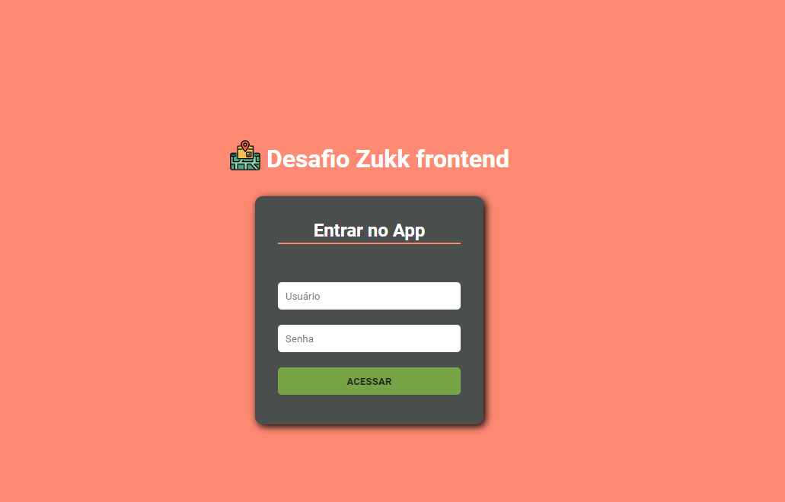
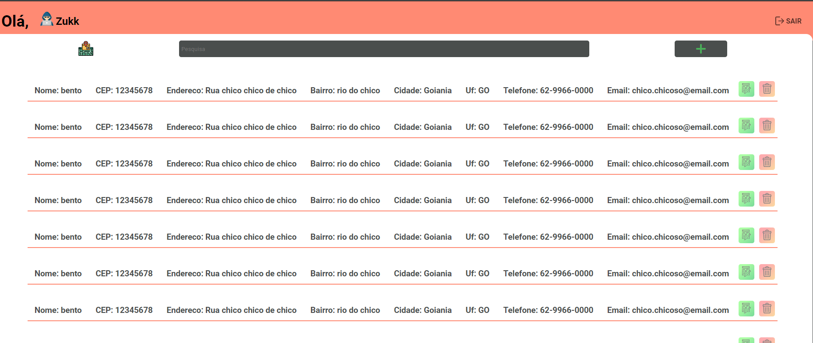
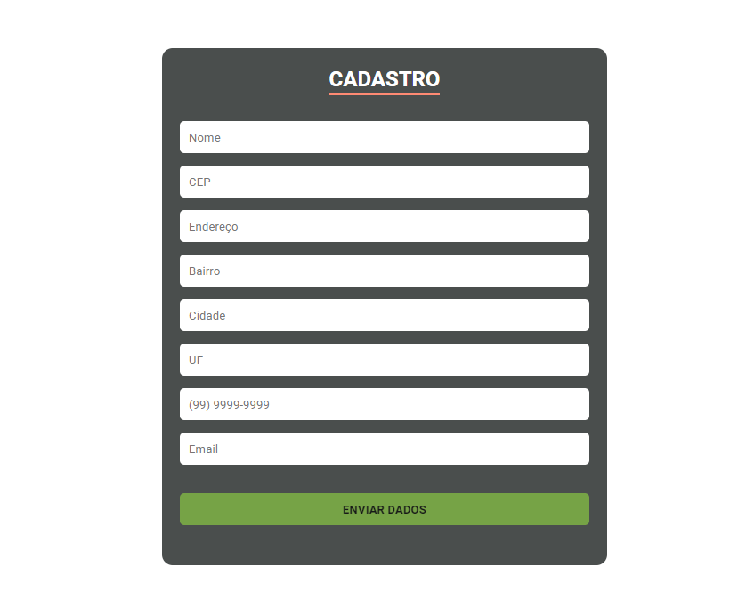

pt-br,

## Instruições

`yarn install` 
 para instalar todas as dependências. 

 Rodar o backend em localhost: 3333 para utilizar as funções do APP, postar, deletar...

### Nota

 Algumas coisas que fora pedidos no test não consegui terminar a tempo, muita delas eu deixei por ultimo por nunca ter realizado algum projeto utilizando a tecnologia, ex.JWT, utilizei o localStoraga para armazenar os dados e começar a codar a aplicação.

Continuarei trabalhando no projeto esse final de Semana (22/01/2020 ao 25/01/2020) pois gostei muito do desafio, e quero terminar ele como havia imaginado, mesmo que não conte para o teste.

Obrigado,

en-us,

## Instructions

`yarn install` 
 to install all dependencies. 

 Run the backend on localhost: 3333 to use the APP functions, post, delete ... 

### Note

 Some things that were requested in the test I couldn't finish on time, many of them I left last because I never carried out any project using the technology, ex.JWT, I used localStoraga to store the data and start coding the application. 

 I will continue working on the project this weekend (22/01/2020 to 25/01/2020) because I really liked the challenge, and I want to finish it as I had imagined, even if I don’t count for the test. 

Thx,

### Prints

### await

[x] - Auto Complet wich CEP number
[x] - Post in Backend
[x] - Delete Post
[] - ChangePost
[] - Mask Phone number
[] - JWT Valid token...

### upDate

[] - Check valid Phone
[] - Responsive/animation
